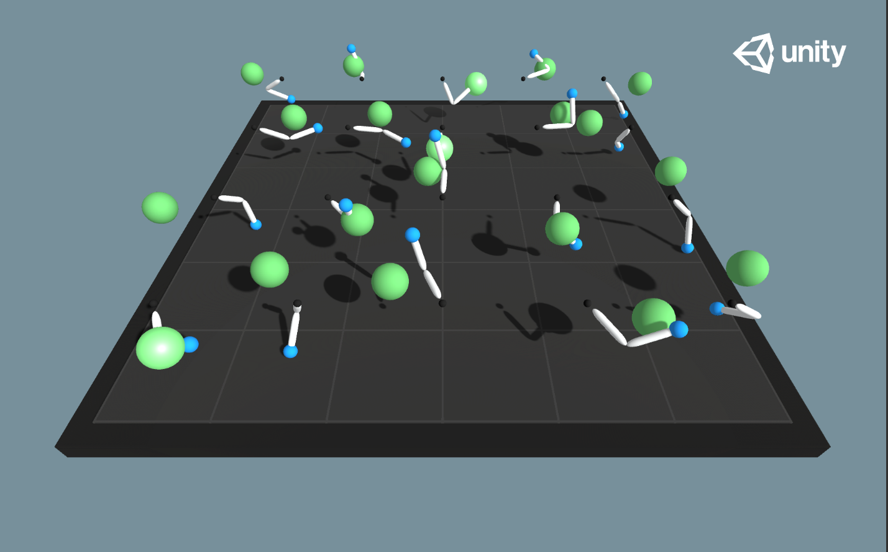

## Project 2: Continuos Control Using Deep Reinforcement Learning

### Content

This repository contains deep deterministic policy gradients [(DDPG)](https://arxiv.org/abs/1509.02971) implementation to solve the [Reacher](https://github.com/Unity-Technologies/ml-agents/blob/master/docs/Learning-Environment-Examples.md#reacher) environment. The agent is a robot arm with two degrees of freedom. The goal of the agent is to maintain its position at the target location for as many time steps as possible as the target is moving. There are 20 agents in this environment and the task is episodic.  The environment is considered solved, when the average score over 100 episodes is at least +30. Specifically,

* After each episode, we add up the rewards that each agent received ,without discounting, to get a score for each agent. This yields 20, potentially different, scores. We then take the average of these 20 scores.
* This yields an average score for each episode, where the average is over all 20 agents.

The Reacher environment contains 20 identical agents, each with its own copy of the environment.  

Behavior Parameters:
* Vector Observation space: 33 variables corresponding to position, rotation, velocity, and angular velocities of the two arms.
* Vector Action space: (Continuous) Size of 4, corresponding to torque applicable to two joints. Every entry in the action vector should be a number between -1 and 1.
* Visual Observations: None.
* A reward of +0.1 is provided for each step that the agent's hand is in the goal location. 

### Dependencies

Install the dependencies using the instructions [here](https://github.com/eayvali/DeepRL).

Download the environment from one of the links below.  You need only select the environment that matches your operating system:

**Reacher Environment Version 2: Twenty (20) Agents_**
 - Linux: [click here](https://s3-us-west-1.amazonaws.com/udacity-drlnd/P2/Reacher/Reacher_Linux.zip)
 - Mac OSX: [click here](https://s3-us-west-1.amazonaws.com/udacity-drlnd/P2/Reacher/Reacher.app.zip)
 - Windows (32-bit): [click here](https://s3-us-west-1.amazonaws.com/udacity-drlnd/P2/Reacher/Reacher_Windows_x86.zip)
 - Windows (64-bit): [click here](https://s3-us-west-1.amazonaws.com/udacity-drlnd/P2/Reacher/Reacher_Windows_x86_64.zip)

### Files

* main_reacher.ipynb        : main file that initializes the environment and trains the agent
* ddpg_agent.py             : defines the agent class and the replay buffer memory
* ddpg_networks.py          : defines the agent and critic networks
* ./Results/Report.pdf      : description of the implementation and results
* ./Results/*checkpoint.pth : saved model weights for the actor and the critic
* ./Results/DDPG_scores.npy : saved episodic scores during training
* ./Results/plot_results.py : plots the scores for each agent over all episodes
* ./Results/*html           : output of main_reacher.ipynb cells

