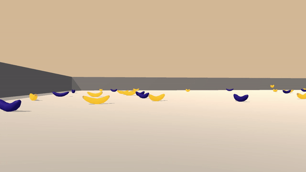
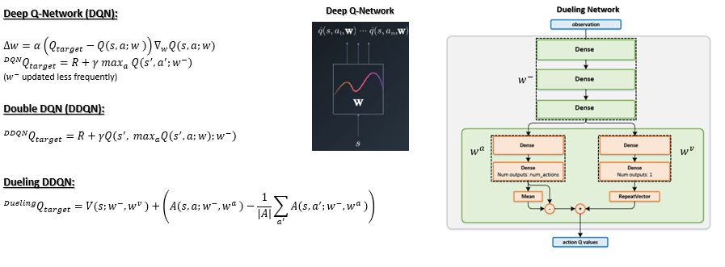

# Project 1: Navigation

### Introduction

In this project, we  train an agent to navigate and collect bananas in a large, square world.  

The goal of the agent is to collect as many yellow bananas as possible while avoiding blue bananas. A reward of +1 is provided for collecting a yellow banana, and a reward of -1 is provided for collecting a blue banana.  

The state space has 37 dimensions and contains the agent's velocity, along with ray-based perception of objects around agent's forward direction.  Given this information, the agent has to learn how to best select actions.  Four discrete actions are available, corresponding to:
- **`0`** - move forward.
- **`1`** - move backward.
- **`2`** - turn left.
- **`3`** - turn right.

The task is episodic, and in order to solve the environment, the agent must get an average score of +13 over 100 consecutive episodes.

This repository contains different deep reinforcement learning arhitectures such as Deep Q-Network (DQN) [1], Double Deep-Q-Learning (DDQN) [2], and Dueling Network[3]. DQN is a simple deep neural network architecture that approximates the Q-value function for a given state. It tends to overestimate the Q-values and can be difficult to train. Therefore, several techniques were developed. This project employs experience replay, where state transitions, actions, and rewards are all saved in a buffer, and uniformly sampled in batches during training. Additionally, a separate network that is updated less frequently was used as a target in calculating the loss during backprop to mitigate oscillations during training. The main difference between DQN and DDQN is the choice of target Q values during training. In DDQN, the greedy policy is evaluated according to the online network, but its value is estimated using the target network. Dueling Network, on the other hand, uses the DDQN target Q-function, but differs from the other two in the representation of the network architecture, which separates the representation of state values and (state-dependent) action advantages. For more details, see [1-3]. 

### Dependencies

Install the dependencies using the instructions [here](https://github.com/eayvali/DeepRL).

### Files

* main.ipynb               : main file that initializes the environment and trains the agent
* Results.ipynb            : plots the scores and runs the trained agent on the Unity environment
* agent.py                 : defines the agent class
* network.py               : defines deep q network and dueling network classes
* Report.pdf               : description of the implementation and results
* ./Results/*checkpoint.pth : saved model weights 
* ./Results/*scores.npy     : saved episodic scores during training
* ./Results/*html           : output of main.ipynb for different network architectures

### References

_[1]_ Mnih, Volodymyr, et al. "Human-level control through deep reinforcement learning." Nature 518.7540 (2015): 529-533.

_[2]_ Van Hasselt, Hado, Arthur Guez, and David Silver. "Deep reinforcement learning with double q-learning." Thirtieth AAAI conference on artificial intelligence. 2016.

_[3]_ Wang, Ziyu, et al. "Dueling network architectures for deep reinforcement learning." arXiv preprint arXiv:1511.06581 (2015).

